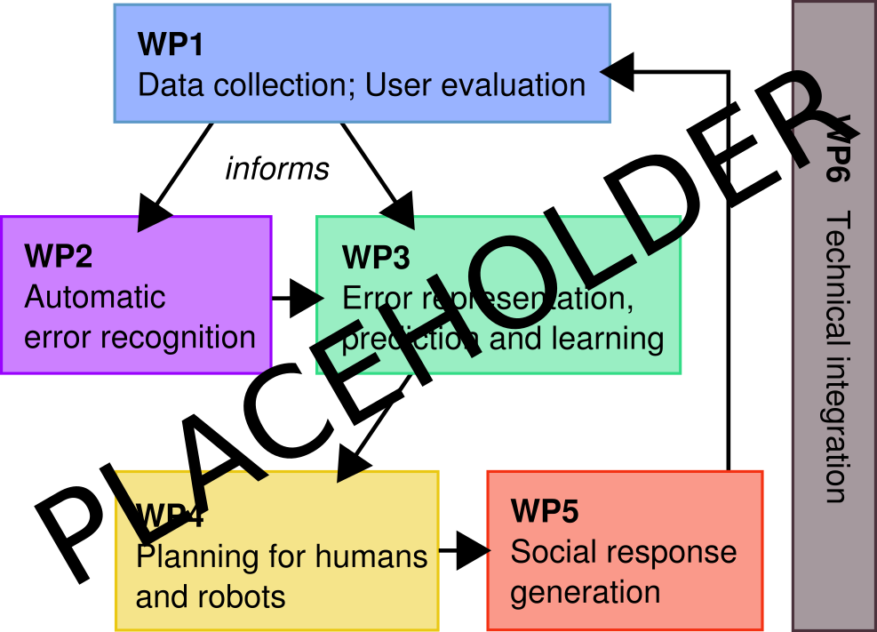

[**FET Open** call details on EU
website](https://ec.europa.eu/info/funding-tenders/opportunities/portal/screen/opportunities/topic-details/fetopen-01-2018-2019-2020;freeTextSearchKeyword=;typeCodes=1;statusCodes=31094501,31094502;programCode=null;programDivisionCode=null;focusAreaCode=null;crossCuttingPriorityCode=null;callCode=31088571;sortQuery=openingDate;onlyTenders=false)

Title of the proposal
---------------------

**Social robots to support human-human interactions**

Acronym
-------

WizMe

Consortium
----------

- Bristol Robotics Lab (BRL), *Séverin Lemaignan, Manuel Giuliani*
- Univeristy of Ghent (GHE), *Tony Belpaeme, Jelle Saldien*
- École Polytechnique Fédérale de Lausanne (EPFL), *Pierre Dillenbourg* (tentative)
- Instituto Superior Técnico, University of Lisbon (IST), *Ana Paiva* (tentative)
- Academic partner in sociology -- Radboud University Nijmegen?
- RedCross UK (RCUK), *Alex Fraser* (first contact; tentative)

Abstract
--------

WizMe is a future-looking project that aims at investigating how social robots
can help building stronger *human* relationships: robots to support human-human
social interactions.

Such robots require unique, beyond state-of-the-art, capabilities to *(1)*
understand the social interactions (*social situation awareness*), *(2)* decide
the best course of action for short-term and longer-term social influence, and
*(3)* perform the appropriate social acts.

In the WizMe project, we propose to scaffold this radically novel line of
research with an original application of high societal impact: we will create a
small set of novel personal companion robots designed to facilitate human-human interactions.
These robots will be deployed in selected school to support the social and
cultural integration of vulnerable children, with a particular focus on migrant
children who might lack the otherwise needed support for a successful
integration (different cultures and social norms; absence of local, culturally
integrated, relatives; language barriers; etc.).

This project is ambitious, and brings together five leading groups in social
human-robot interaction, interaction design and human socio-developmental
psychology, with unique expertise and contributions: The Bristol Robotics Lab,
the largest UK robotic lab, has a long history of running and leading complex
projects involving hardware, software and AI, with a strong track record in
human-robot interaction and assistive robotics; the University of Ghent will
provide world-leading expertise on robot design for interaction with children;
the EPFL's CHILI lab has a unique expertise in blending technology (and social
robotics in particular) in teaching environments, with a focus on rich
social interaction; the IST is recognised as a leading group in expressive
social agents and also has a very strong track record in child-robot
interactions; finally [socio-psychology partner].

Critically, the complex interaction design that lies at the core of the project
will be informed and co-led by the Refugee Support department of RedCross UK,
one of the largest NGO world-wide.

\pagebreak

**[Sections 1, 2, 3 are 15 pages max]**

Excellence
==========

Long-term vision and targeted breakthrough towards that vision
--------------------------------------------------------------

\ 

WizMe is a project that aims at helping to build strong human relationships with the
help of technology.

The core idea of the project is to build small companion robots whose aim is to
facilitate human-human interactions. We want to develop these robots with a
particular application in mind: supporting the social and cultural integration
of vulnerable children in a foreign country, and in particular, migrant children
who might lack the otherwise needed support (shared culture; already well
integrated relatives) for a successful integration.

### Key scientific research questions

- explore the novel concept of robot-supported human-human interactions:
- establish trust between the child and the robot
- mediation of cross-cultural interactions
- modalities of interactions that are well suited for the field
- privacy
- ...

Novelty, non-incrementality, plausibility and foundational character
--------------------------------------------------------------------

#### Existing robots

##### Miro

{ width=50% }

{width=50%}

##### Hatchnimals

{width=50%}

##### Tega

{width=50%}

##### Cellulo

{width=50%}

[@ozgur2017cellulo]

##### Cozmo

{width=50%}

Research methodology
--------------------

### Overview of the interaction

A robot is left with the child when he or she starts their journey in their new
host country, and becomes a companion for the child during the first months of
the integration. Using several mechanisms that are
discussed in this proposal, the robot helps the child to gain self-confidence,
and ultimately engage in successful social interactions with other children.

Critically, the robot is designed to support the
social and cultural integration of the child *amongst her/his peers*. While the
child might build affective/emotional bonds with the robot over the course of
the support period, the robot behaviour is designed to ensure that these bonds
do not substitute themselves to the interactions with other children.

The project combines a range of scientific and engineering endeavours to realise
within a 5-years timeframe an ambitious and bold vision for social robotics in
our society. Specifically, the project draws from the fields of social robotics;
human-robot interaction; human-machine interaction design; and mechatronics.

While the breadth of the proposed project is significant (from mechatronic
design to long-term field testing with vulnerable populations), the project structure
minimizes the cross-dependencies within the project, avoiding critical
failure points that would put the whole project at risk, and a careful risk
assessment is conducted that includes meaningful mitigation strategies.

### Deployments in schools

Interdisciplinarity
-------------------

Impact
======

Impact on society and technology: building an inclusive society
---------------------------------------------------------------

Impact on future leadership
---------------------------

Measures for achieving impact
-----------------------------

### Dissemination and exploitation of results

### Communication activities

Implementation
==============

Workplan and intermediate targets
---------------------------------

### Project structure

| Work package No |  Work package title |  Lead participant No |  Lead participant short name | Person-Months | Start month | End month |
|-----------------|---------------------|----------------------|------------------------------|---------------|-------------|-----------|
| 1               |                     |                      |                              |               |             |           |
| 2               |                     |                      |                              |               |             |           |
| 3               |                     |                      |                              |               |             |           |
| 4               |                     |                      |                              |               |             |           |
| 5               |                     |                      |                              |               |             |           |
| 6               |                     |                      |                              |               |             |           |
|                 |                     |                      |                              | Total months  |             |           |

### Work package 1: Project management

| Work package number             | 1 | Lead beneficiary |   |           |   |   |   |
|---------------------------------|---|------------------|---|-----------|---|---|---|
| Work package title              |   |                  |   |           |   |   |   |
| Participant number              |   |                  |   |           |   |   |   |
| Short name of participant       |   |                  |   |           |   |   |   |
|  Person/months per participant: |   |                  |   |           |   |   |   |
| Start month                     |   |                  |   | End month |   |   |   |

**Objectives:**

**Description of work:**

...description...

- *Task T1.1*:

**Deliverables:**

- *Deliverable D1.1* (Month 2): website and logo

### Work package 2: Interaction design for robot-supported human-human interactions

| Work package number             | 2 | Lead beneficiary |  IST          |   |   |   |
|---------------------------------|---|------------------|---|-----------|---|---|---|
| Work package title              |   |                  |   |           |   |   |   |
| Participant number              |   |                  |   |           |   |   |   |
| Short name of participant       | IST  | GHE | RCUK    |   |           |   |   |   |
|  Person/months per participant: |   |                  |   |           |   |   |   |
| Start month                     |   |                  |   | End month |   |   |   |

**Objectives:**

- Role of the interaction designer: refine interaction modalities (in particular,
the non-verbal speech), details cross-modal interactions, define interaction
patterns with the child

**Description of work:**

...description...

- *Task T2.1*:

**Deliverables:**

- *Deliverable D2.1* (Month ..):

### Work package 3: Design and build a companion robot for social interaction in the field

| Work package number             | 3 | Lead beneficiary |  GHE             |   |   |   |
|---------------------------------|---|------------------|---|-----------|---|---|---|
| Work package title              |   |                  |   |           |   |   |   |
| Participant number              |   |                  |   |           |   |   |   |
| Short name of participant       | GHE  | EPFL          |   |           |   |   |   |
|  Person/months per participant: |   |                  |   |           |   |   |   |
| Start month                     |   |                  |   | End month |   |   |   |

**Objectives:**

- long term interaction
- one full day of autonomy
- rugged [@ozgur2017cellulo]
- child friendly: mechanical constraints + design

[@ozgur2016permanent]
[@hostettler2016realtime]

**Description of work:**

Develop a novel platform, including
- chassis
- power autonomy for one day
- on-board compute suitable for deep learning (NVidia TX2?)
- vision (embedded RGB-D camera)
- audio processing

...description...

- *Task T3.1*:

**Deliverables:**

- *Deliverable D3.1* (Month ..):

### Work package 4: AI for social cognition

| Work package number             | 4 | Lead beneficiary |   |           |   |   |   |
|---------------------------------|---|------------------|---|-----------|---|---|---|
| Work package title              |   |                  |   |           |   |   |   |
| Participant number              |   |                  |   |           |   |   |   |
| Short name of participant       |   |                  |   |           |   |   |   |
|  Person/months per participant: |   |                  |   |           |   |   |   |
| Start month                     |   |                  |   | End month |   |   |   |

**Objectives:**

**Description of work:**

...description...

- *Task T4.1*:

**Deliverables:**

- *Deliverable D4.1* (Month ..):

### Work package 5: Field testing and deployments

| Work package number             | 5 | Lead beneficiary |   |           |   |   |   |
|---------------------------------|---|------------------|---|-----------|---|---|---|
| Work package title              |   |                  |   |           |   |   |   |
| Participant number              |   |                  |   |           |   |   |   |
| Short name of participant       |   |                  |   |           |   |   |   |
|  Person/months per participant: |   |                  |   |           |   |   |   |
| Start month                     |   |                  |   | End month |   |   |   |

**Objectives:**

**Description of work:**

...description...

- *Task T5.1*:

**Deliverables:**

- *Deliverable D5.1* (Month ..):

### Work package 6: Dissemination and exploitation

| Work package number             | 6 | Lead beneficiary |   |           |   |   |   |
|---------------------------------|---|------------------|---|-----------|---|---|---|
| Work package title              |   |                  |   |           |   |   |   |
| Participant number              |   |                  |   |           |   |   |   |
| Short name of participant       |   |                  |   |           |   |   |   |
|  Person/months per participant: |   |                  |   |           |   |   |   |
| Start month                     |   |                  |   | End month |   |   |   |

**Objectives:**

**Description of work:**

...description...

- *Task T6.1*:

**Deliverables:**

- *Deliverable D6.1* (Month ..):

### Deliverables overview

| Deliverable |  Deliverable name |   Work package No |  Lead participant short name | Type |  Dissemination level |  Delivery date |
|-------------|-------------------|-------------------|------------------------------|------|----------------------|----------------|
|   D1.1      |                   |                   |                              |      |                      |                |
| D1.2        |                   |                   |                              |      |                      |                |
| D2.1        |                   |                   |                              |      |                      |                |
| ...         |                   |                   |                              |      |                      |                |

Type:

- R: Document, report (excluding the periodic and final reports)
- DEM: Demonstrator, pilot, prototype, plan designs
- DEC: Websites, patents filing, press & media actions, videos, etc.
- OTHER: Software, technical diagram, etc.

Dissemination level:

- PU = Public, fully open, e.g. web
- CO = Confidential, restricted under conditions set out in Model Grant Agreement
- CI = Classified, information as referred to in Commission Decision 2001/844/EC.

### Gantt chart

{ height=25cm }\

### Workpackage interrelations

\

Management structure, milestones and procedures
-----------------------------------------------

### Milestones

- week-long tests with local children in local schools
- field deployment with one child in one school

|  Milestone number |  Milestone name |  Related work package(s) |  Estimated date |  Means of verification |
|-------------------|-----------------|--------------------------|-----------------|------------------------|
|                   |                 |                          |                 |                        |
|                   |                 |                          |                 |                        |
|                   |                 |                          |                 |                        |
|                   |                 |                          |                 |                        |

### Risks

|  Description of risk     |   Work package(s) involved |  Proposed risk mitigation measures |
|--------------------------|----------------------------|------------------------------------|
| risk 1 (low/medium/high) |                            |                                    |
|                          |                            |                                    |
|                          |                            |                                    |
|                          |                            |                                    |

Relevance of expertise in the consortium
----------------------------------------

This project is ambitious, and brings together five leading groups in social
human-robot interaction, interaction design and human socio-developmental
psychology, with unique expertise and contributions: The Bristol Robotics Lab,
the largest UK robotic lab, has a long history of running and leading complex
projects involving hardware, software and AI, with a strong track record in
human-robot interaction and assistive robotics; the University of Ghent will
provide world-leading expertise on robot design for interaction with children;
the EPFL's CHILI lab has a unique expertise in blending technology (and social
robotics in particular) in teaching environments, with a focus on rich
social interaction; the IST is recognised as a leading group in expressive
social agents and also has a very strong track record in child-robot
interactions; finally [socio-psychology partner].

Critically, the complex interaction design that lies at the core of the project
will be informed and co-led by the Refugee Support department of RedCross UK,
one of the largest NGO world-wide.

Appropriate allocation and justification of resources
-----------------------------------------------------

(person-months, equipment,
budget)

**Summary of staff effort**

|                      | WP1 | WP2 | WP3 | WP4 | WP5 | WP6 |  Total person/months per participant |
|----------------------|-----|-----|-----|-----|-----|-----|--------------------------------------|
| BRL                  |     |     |     |     |     |     |                                      |
| GHE                  |     |     |     |     |     |     |                                      |
| EPFL                 |     |     |     |     |     |     |                                      |
| IST                  |     |     |     |     |     |     |                                      |
| RUN                  |     |     |     |     |     |     |                                      |
| RCUK                 |     |     |     |     |     |     |                                      |
|  Total person/ month |     |     |     |     |     |     |                                      |

**Other direct cost**

| BRL                       | Cost | Justification |
|---------------------------|------|---------------|
| Travel                    |      |               |
| Equipment                 |      |               |
|  Other goods and services |      |               |
| Total                     |      |               |

\newpage

Members of the consortium
=========================

Participants
------------

For each partners:

- a description of the legal entity and its main tasks, with an explanation of how its profile matches the tasks in the proposal;
- a curriculum vitae or description of the profile of the persons, including their gender, who will be primarily responsible for carrying out the proposed research and/or
innovation activities;
- a list of up to 5 relevant publications, and/or products, services (including widely-used datasets or software), or other achievements relevant to the call content;
- a list of up to 5 relevant previous projects or activities, connected to the subject of this proposal;
- a description of any significant infrastructure and/or any major items of technical
equipment, relevant to the proposed work;

### Bristol Robotics Lab

#### Institution

The *Bristol Robotics Laboratory (BRL)* is the largest co-located and
most comprehensive advanced robotics research establishment in the UK. It is a
joint venture between the University of the West of England and the University
of Bristol. BRL's multidisciplinary approach aims to create autonomous devices
capable of working independently, with each other, or with humans. BRL draws on
robotics, electrical \& mechanical engineering, computer science, psychology,
cognitive science and sociology. BRL has an international reputation as a
leading research centre in advanced robotics research and has over 250
researchers working on a broad portfolio of topics: HRI, collective robotics,
aerial robotics, neuro-inspired control, haptics, control systems, energy
harvesting and self-sustaining systems, rehabilitation robotics, soft robotics
and biomedical systems. BRL has many collaboration partnerships, both national
and international, and is experienced in managing large multi-site projects. BRL
has support from two embedded units specialising in business and enterprise,
together with an incubator and successful track record of spin-outs.

#### Principal investigators

Dr Séverin Lemaignan is Senior Researcher at the Bristol Robotics Laboratory,
University of the West of England, Bristol. Previously, he obtained a joint PhD
in Cognitive Robotics from the CNRS/LAAS (France) and the Technical University
of Munich (Germany) for which he received the Best PhD in Robotics 2012 award
from French CNRS. He then conducted his research as Research Fellow at EPFL
(Switzerland) and Plymouth University (UK) where he was Lecturer in Robotics
until 2018. Dr Séverin Lemaignan has been involved in several European projects
related to social and cognitive robotics: CHRIS (Cooperative Human Robot
Interaction Systems), DREAM (Development of Robot-Enhanced therapy for children
with AutisM spectrum disorders), L2TOR (Second language TutOring using social
Robots). He has also been awarded in 2015 a EU H2020 Marie Sklodowska-Curie
Individual Fellowship for his project DoRoThy (Donating Robots a Theory of
Mind).  His research interests primarily concern the socio-cognitive aspects of
human-robot interaction, both from the perspective of the human cognition and
the design of cognitive architectures for the robots. More recently, he has been
focusing his experimental work on child-robot interactions in educative
settings, exploring how robots can support teachers and therapists to develop
effective and engaging novel learning paradigms.

Pr Manuel Giuliani...

### University of Ghent

*Tony Belpaeme, Jelle Saldien*

### École Polytechnique Fédérale de Lausanne

*Pierre Dillenbourg*

### Instituto Superior Técnico, University of Lisbon

*Ana Paiva*

### Academic partner in sociology -- Radboud University Nijmegen?

### RedCross UK (RCUK)

*Alex Fraser*

Third parties involved in the project
-------------------------------------

No third parties involved? maybe for some subcontracting?

Ethics and Security
===================

Ethics
------

Security
--------

- this project involves activities or results raising security issues: NO
- this project involves 'EU-classified information' as background or results: NO

