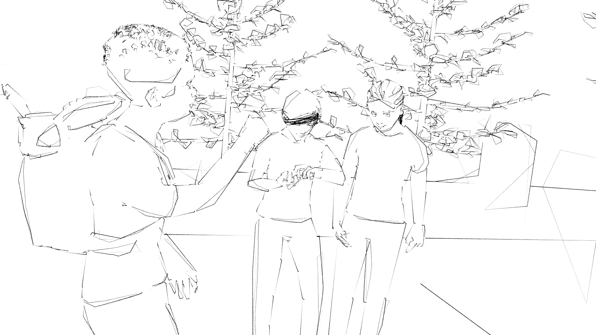
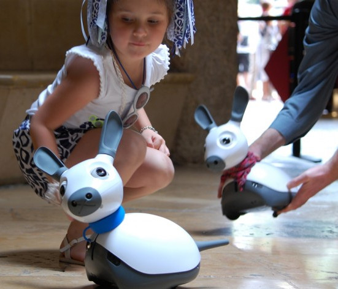
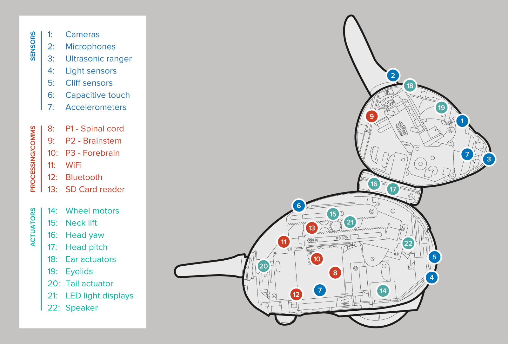
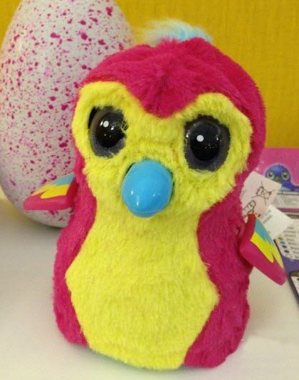
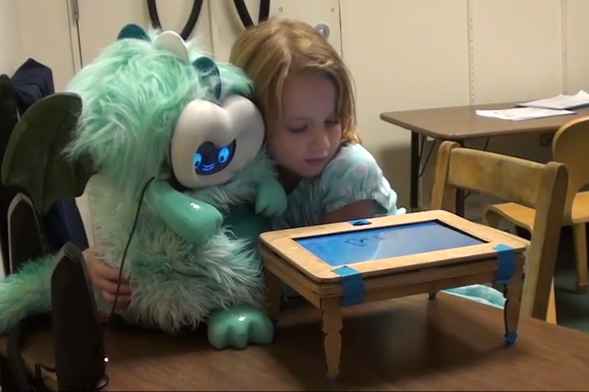
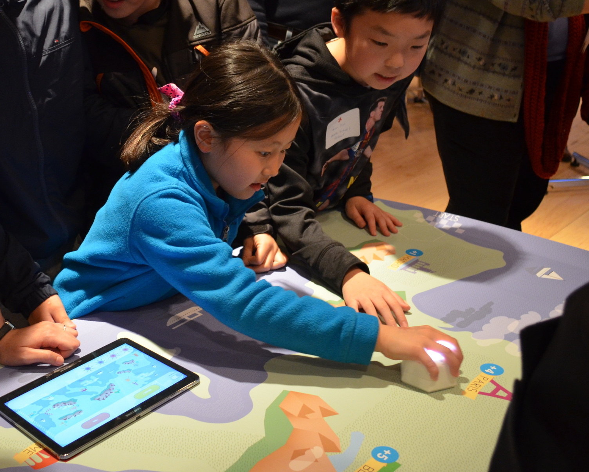
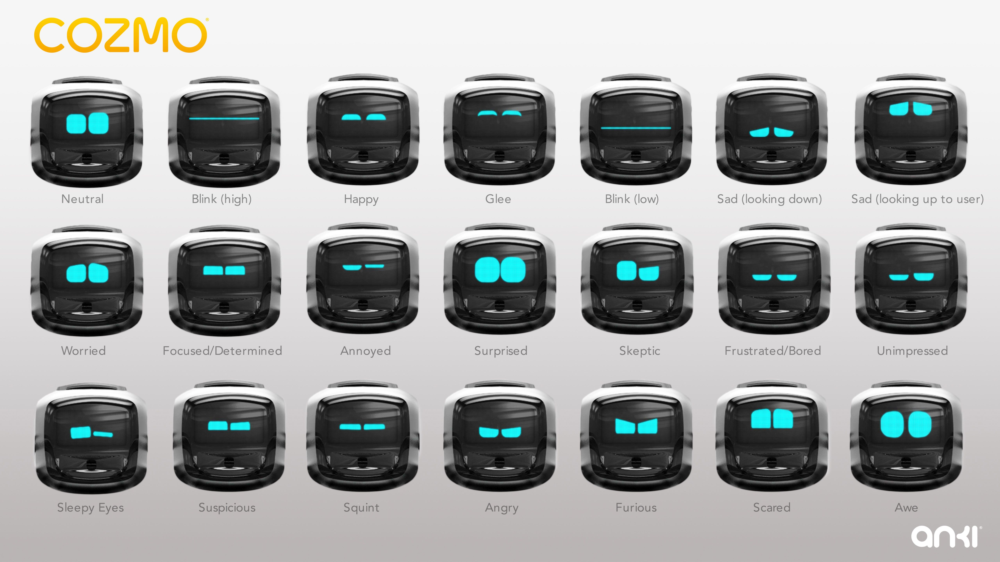

WizMe
=====

WizMe is a project that aims at helping to build strong human relationships with the
help of technology.

The core idea of the project is to build small companion robots whose aim is to
facilitate human-human interactions. We want to develop these robots with a
particular application in mind: supporting the social and cultural integration
of vulnerable children in a foreign country, and in particular, migrant children
who might lack the otherwise needed support (shared culture; already well
integrated relatives) for a successful integration.

Overview of the interaction
---------------------------

A robot is left with the child when he or she starts their journey in their new
host country, and becomes a companion for the child during the first months of
the integration. Using several mechanisms that are
discussed in this proposal, the robot helps the child to gain self-confidence,
and ultimately engage in successful social interactions with other children.

Critically, the robot is designed to support the
social and cultural integration of the child *amongst her/his peers*. While the
child might build affective/emotional bonds with the robot over the course of
the support period, the robot behaviour is designed to ensure that these bonds
do not substitute themselves to the interactions with other children.

The project combines a range of scientific and engineering endeavours to realise
within a 5-years timeframe an ambitious and bold vision for social robotics in
our society. Specifically, the project draws from the fields of social robotics;
human-robot interaction; human-machine interaction design; and mechatronics.

While the breadth of the proposed project is significant (from mechatronic
design to long-term field testing with vulnerable populations), the project structure
minimizes the cross-dependencies within the project, avoiding critical
failure points that would put the whole project at risk, and a careful risk
assessment is conducted that includes meaningful mitigation strategies.

Key scientific research questions
---------------------------------

- explore the novel concept of robot-supported human-human interactions:
- establish trust between the child and the robot
- mediation of cross-cultural interactions
- modalities of interactions that are well suited for the field
- privacy
- ...

Project milestones
------------------

- week-long tests with local children in local schools
- field deployment with one child in one school

Impact
------

### Impact on society: building an inclusive society

### Scientific impact: social robotics on the field

Build a robot for social interaction on the field
-------------------------------------------------

### Requirements

- long term interaction
- one full day of autonomy
- rugged [@ozgur2017cellulo]
- child friendly: mechanical constraints + design

[@ozgur2016permanent]
[@hostettler2016realtime]

### Existing robots

#### Miro

#### Hatchnimals

#### Tega

#### Cellulo

[@ozgur2017cellulo]

#### Cozmo

Plan to hire one mechatronics engineer and one interaction designer

Role of the mechatronics engineer: develop a novel platform, including
- chassis
- power autonomy for one day
- on-board compute suitable for deep learning (NVidia TX2?)
- vision (embedded RGB-D camera)
- audio processing

Role of the interaction designer: refine interaction modalities (in particular,
the non-verbal speech), details cross-modal interactions, define interaction
patterns with the child

Measuring how effective the project is
--------------------------------------

Risk assessment
---------------

References
----------

