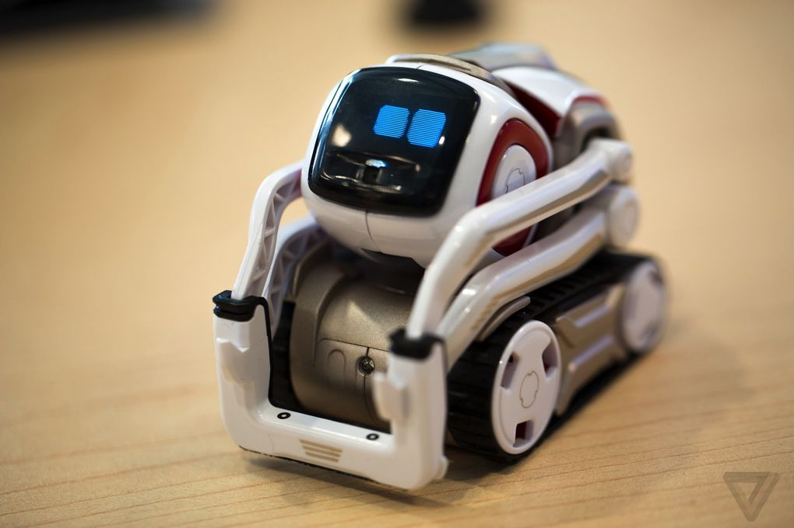

[part B1] The research proposal
===============================
(max 5 pages)

\ 

WizMe is a project that aims at helping to build strong human relationships with the
help of technology.

The core idea of the project is to build small companion robots whose aim is to
facilitate human-human interactions. We want to develop these robots with a
particular application in mind: supporting the social and cultural integration
of vulnerable children in a foreign country, and in particular, migrant children
who might lack the otherwise needed support (shared culture; already well
integrated relatives) for a successful integration.

Overview of the interaction
---------------------------

A robot is left with the child when he or she starts their journey in their new
host country, and becomes a companion for the child during the first months of
the integration. Using several mechanisms that are
discussed in this proposal, the robot helps the child to gain self-confidence,
and ultimately engage in successful social interactions with other children.

Critically, the robot is designed to support the
social and cultural integration of the child *amongst her/his peers*. While the
child might build affective/emotional bonds with the robot over the course of
the support period, the robot behaviour is designed to ensure that these bonds
do not substitute themselves to the interactions with other children.

The project combines a range of scientific and engineering endeavours to realise
within a 5-years timeframe an ambitious and bold vision for social robotics in
our society. Specifically, the project draws from the fields of social robotics;
human-robot interaction; human-machine interaction design; and mechatronics.

While the breadth of the proposed project is significant (from mechatronic
design to long-term field testing with vulnerable populations), the project structure
minimizes the cross-dependencies within the project, avoiding critical
failure points that would put the whole project at risk, and a careful risk
assessment is conducted that includes meaningful mitigation strategies.

Impact
------

### Impact on society: building an inclusive society

### Scientific impact: social robotics on the field

Research objectives and work programme
--------------------------------------

### Key scientific research questions

- explore the novel concept of robot-supported human-human interactions:
- establish trust between the child and the robot
- mediation of cross-cultural interactions
- modalities of interactions that are well suited for the field
- privacy
- ...

### Project structure

#### Work package 1: project management

#### Work package 2: Sociology of Technologies in the context of integration

#### Work package 3: Robot design

#### Work package 4: AI for social cognition

#### Work package 5: Field testing and deployments

#### Main milestones

- week-long tests with local children in local schools
- field deployment with one child in one school

#### Gantt chart

{ height=25cm }\

### WP2: Build a robot for social interaction on the field

#### Requirements

- long term interaction
- one full day of autonomy
- rugged [@ozgur2017cellulo]
- child friendly: mechanical constraints + design

[@ozgur2016permanent]
[@hostettler2016realtime]

#### Existing robots

##### Miro

{ width=50% }

{width=50%}

##### Hatchnimals

{width=50%}

##### Tega

{width=50%}

##### Cellulo

{width=50%}

[@ozgur2017cellulo]

##### Cozmo

{width=50%}

Plan to hire one mechatronics engineer and one interaction designer

Role of the mechatronics engineer: develop a novel platform, including
- chassis
- power autonomy for one day
- on-board compute suitable for deep learning (NVidia TX2?)
- vision (embedded RGB-D camera)
- audio processing

Role of the interaction designer: refine interaction modalities (in particular,
the non-verbal speech), details cross-modal interactions, define interaction
patterns with the child

### Measuring how effective the project is

\newpage

The principal Investigator
==========================

Curriculum vitae
----------------
(max 2 pages)

Early achievements track-record
-------------------------------
(max 2 pages)

Dr Séverin Lemaignan is Senior Researcher at the Bristol Robotics Laboratory,
University of the West of England, Bristol. Previously, he obtained a joint PhD
in Cognitive Robotics from the CNRS/LAAS (France) and the Technical University
of Munich (Germany) for which he received the Best PhD in Robotics 2012 award
from French CNRS. He then conducted his research as Research Fellow at EPFL
(Switzerland) and Plymouth University (UK) where he was Lecturer in Robotics
until 2018. Dr Séverin Lemaignan has been involved in several European projects
related to social and cognitive robotics: CHRIS (Cooperative Human Robot
Interaction Systems), DREAM (Development of Robot-Enhanced therapy for children
with AutisM spectrum disorders), L2TOR (Second language TutOring using social
Robots). He has also been awarded in 2015 a EU H2020 Marie Sklodowska-Curie
Individual Fellowship for his project DoRoThy (Donating Robots a Theory of
Mind).  His research interests primarily concern the socio-cognitive aspects of
human-robot interaction, both from the perspective of the human cognition and
the design of cognitive architectures for the robots. More recently, he has been
focusing his experimental work on child-robot interactions in educative
settings, exploring how robots can support teachers and therapists to develop
effective and engaging novel learning paradigms.

[part B2] The scientific proposal
=================================
(max 15 pages)

a. State of the art and objectives
----------------------------------

b. Methodology
--------------

### Risk assessment

c. Resources
------------

### Host institution

The *Bristol Robotics Laboratory (BRL)* is the largest co-located and
most comprehensive advanced robotics research establishment in the UK. It is a
joint venture between the University of the West of England and the University
of Bristol. BRL's multidisciplinary approach aims to create autonomous devices
capable of working independently, with each other, or with humans. BRL draws on
robotics, electrical \& mechanical engineering, computer science, psychology,
cognitive science and sociology. BRL has an international reputation as a
leading research centre in advanced robotics research and has over 250
researchers working on a broad portfolio of topics: HRI, collective robotics,
aerial robotics, neuro-inspired control, haptics, control systems, energy
harvesting and self-sustaining systems, rehabilitation robotics, soft robotics
and biomedical systems. BRL has many collaboration partnerships, both national
and international, and is experienced in managing large multi-site projects. BRL
has support from two embedded units specialising in business and enterprise,
together with an incubator and successful track record of spin-outs.

\newpage

References
==========

